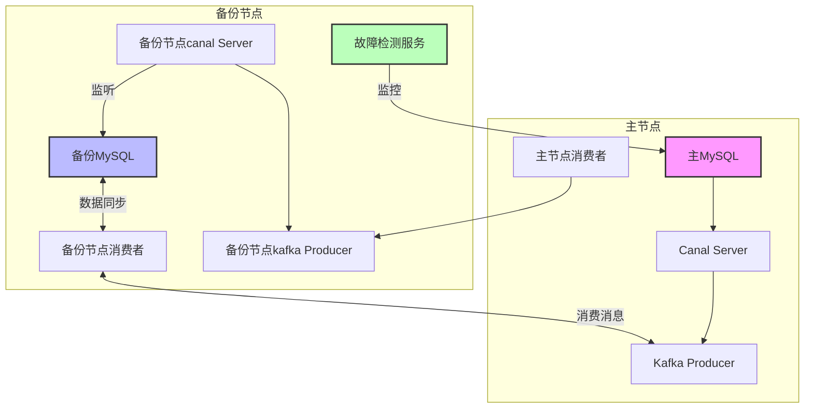
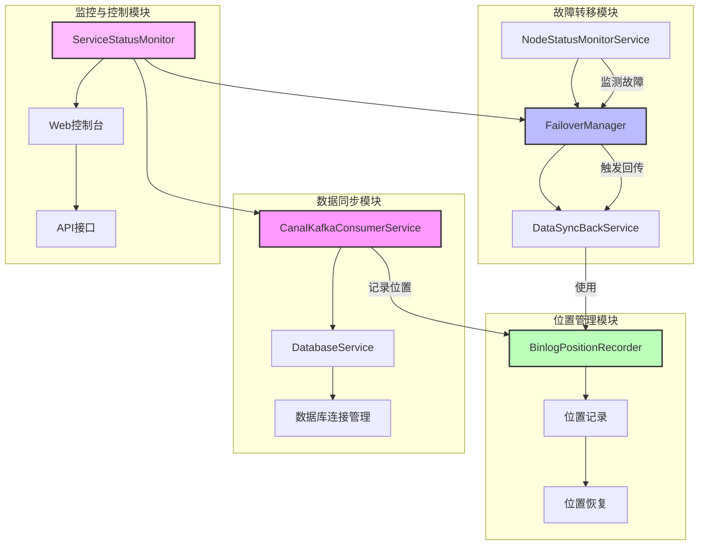
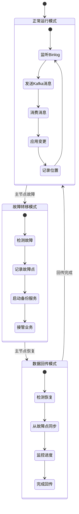

# MySQL 数据同步与故障转移系统


## 系统架构

系统由以下核心组件构成：

1. **Canal 服务**：监听 MySQL binlog 并将变更转换为消息
2. **Kafka 消息队列**：作为数据传输的中间件
3. **数据同步服务**：消费 Kafka 消息并应用到目标数据库
4. **故障检测与转移服务**：监控节点状态并处理故障转移流程


### 系统架构图



## 核心功能

### 1. 数据同步

- 基于 Canal 捕获 MySQL binlog 变更
- 通过 Kafka 消息队列传输数据变更
- 支持 INSERT、UPDATE、DELETE 和 DDL 操作的同步
- 实时应用数据变更到目标数据库

### 2. 故障转移

- 实时监控主节点状态
- 自动检测主节点故障
- 备份节点自动接管业务
- 记录故障转移点位置，确保数据一致性

### 3. 数据回传

- 主节点恢复后自动进行数据回传
- 从故障点开始同步数据变更
- 监控回传进度，确保数据完整性
- 完成回传后自动切换回正常模式

### 4. 系统监控

- 实时监控节点状态
- 跟踪数据同步进度
- 记录系统事件和错误
- 提供可视化的监控界面

### 功能模块图



## 工作流程图



## 主要组件说明

### 服务层 (Service)

#### 1. FailoverManager

故障转移管理器，负责处理主节点故障和恢复的核心逻辑。

主要功能：
- 处理主节点故障转移流程
- 管理主节点恢复和数据回传流程
- 监控数据回传进度
- 维护系统状态

#### 2. CanalKafkaConsumerService

Canal Kafka 消费者服务，负责消费 Kafka 消息并应用数据变更。

主要功能：
- 消费 Canal 通过 Kafka 发送的数据变更消息
- 处理各类数据库操作（INSERT、UPDATE、DELETE、DDL）
- 记录处理位置和错误信息
- 支持消息重试和错误处理

#### 3. DatabaseService

数据库服务，负责执行数据库操作和管理数据库连接。

主要功能：
- 执行 SQL 语句和数据库操作
- 处理表结构变更和数据同步
- 管理数据库连接和事务
- 确保数据一致性

#### 4. DataSyncBackService

数据回传服务，负责在主节点恢复后进行数据回传。

主要功能：
- 从故障转移点开始同步数据
- 管理数据回传流程
- 监控回传进度
- 处理回传过程中的异常

#### 5. NodeStatusMonitorService

节点状态监控服务，负责监控各节点的健康状态。

主要功能：
- 定期检查节点状态
- 检测节点故障
- 触发故障转移流程
- 维护节点状态信息

### 配置层 (Config)

#### 1. DataSourceConfig

数据源配置，负责配置和管理数据库连接。

#### 2. KafkaListenerConfig

Kafka 监听器配置，负责配置 Kafka 消费者。

#### 3. MessageDeserializerWrapper

消息反序列化包装器，负责将 Kafka 消息反序列化为 Canal 消息对象。

### 控制器层 (Controller)

提供 RESTful API 接口，用于系统监控和手动操作。

主要控制器：
- FailoverController：故障转移控制
- DatabaseSyncController：数据同步控制
- CanalMessageController：消息处理控制
- NodeStatusController：节点状态监控
- TransferProgressController：传输进度监控
- ServiceStatusController：服务状态监控

## 工作流程

### 正常运行模式

1. Canal 服务监听 MySQL binlog
2. 数据变更通过 Kafka 消息队列传输
3. CanalKafkaConsumerService 消费消息并应用变更
4. 系统定期保存同步位置信息

### 故障转移模式

1. NodeStatusMonitorService 检测到主节点故障
2. FailoverManager 启动故障转移流程
3. 记录故障转移点位置
4. 备份节点接管业务
5. 启动数据同步服务

### 恢复模式

1. 检测到主节点恢复
2. 启动数据回传流程
3. 从故障转移点开始同步数据
4. 监控回传进度
5. 完成回传后切换回正常模式

## 配置说明

系统配置主要在 `application.yml` 文件中，包括：

- 数据库连接配置
- Kafka 配置
- Canal 配置
- 故障转移配置
- 监控和健康检查配置

## 使用说明

### 启动系统

使用 Spring Boot 启动类 `CanalSyncApplication` 启动系统：

```bash
mvn spring-boot:run -Dspring-boot.run.main-class=com.mysql_sync_test.mysql_sync.CanalSyncApplication
```

### API 接口

系统提供以下主要 API 接口：

- `/api/failover/*`：故障转移相关操作
- `/api/sync/*`：数据同步相关操作
- `/api/status/*`：系统状态监控
- `/api/progress/*`：传输进度监控

